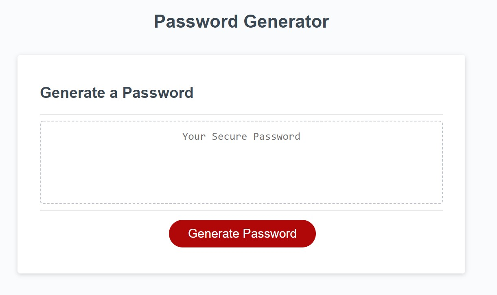

# homework-3

## 03 JavaScript: Password Generator

This project was built to provide users with strong passwords that provide greater security for accessing sensitive data. The password generator prompts users to select different character types for additional strength, ensures that the password is the optimal length, and generates a password meeting the user's selected criteria in the appropriate box. 

## Mock-up

## Installation

All elements of the project are contained here: https://github.com/matthewestes33/homework-3

## Credits

Referenced tutorials from MDN Web Pages and W3Schools:

JavaScript Popup Boxes: https://www.w3schools.com/js/js_popup.asp

Reference Statements - Return: https://developer.mozilla.org/en-US/docs/Web/JavaScript/Reference/Statements/return

## Features

User is provided with a series of prompts for password criteria.

User can select criteria for a more personalized password.

User can select from a wide-range of password lengths (between 8 and 128 characters).

User is prevented from selecting a password outside of the recommended range. 

Password is generated according to user specifications in an easy-to-read, intuitive location in the middle of browser page. 